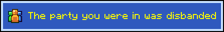

# Toasts

Friends

Whether friend toasts are shown.

.png>)

**Type:** boolean\
**Default:** true

Parties

Whether party toasts are shown.

.png>)

**Type:** boolean\
**Default:** true

Quests

Whether quest toasts are shown.

.png>)

**Type:** boolean\
**Default:** true

Achievements

Whether achievement toasts are shown.

.png>)

**Type:** boolean\
**Default:** true

Event Announcements

Whether to show a toast when an event is soon.\
Pulled from the mcc.live API.

**Type:** boolean\
**Default:** true

